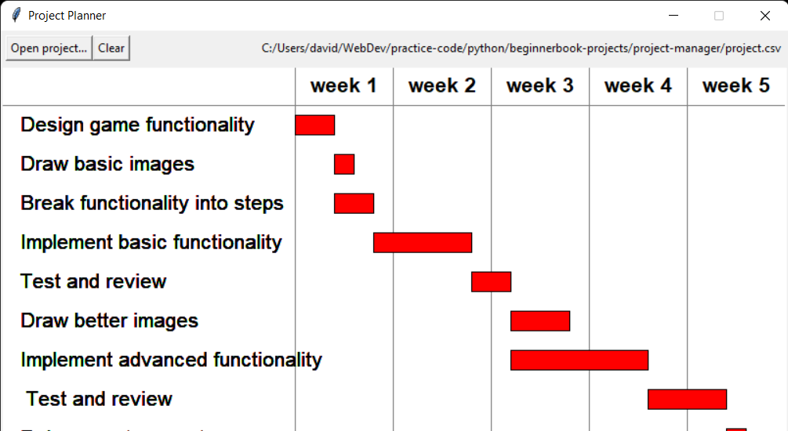

# Project Manager - Python Program

This project creates a GUI that displays a chart listing tasks for a project in and the flow of when the tasks are completed in order.



<br><br>

The program allows you to choose a csv file in your current directory or clear the canvas and choose another file.
<br><br>
```python
import csv
from collections import namedtuple
import tkinter
from tkinter.filedialog import askopenfilename
```
<small>*\*Imports 3 built-in python modules*</small>

This project is part of the *Beginner's Step-By-Step Coding Course*